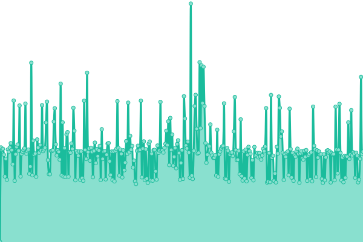
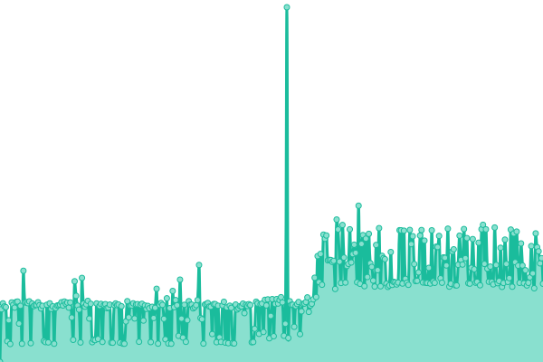
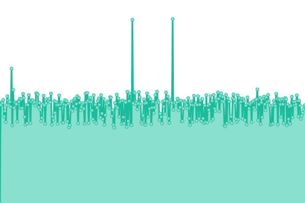
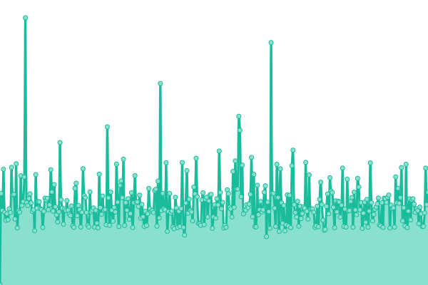
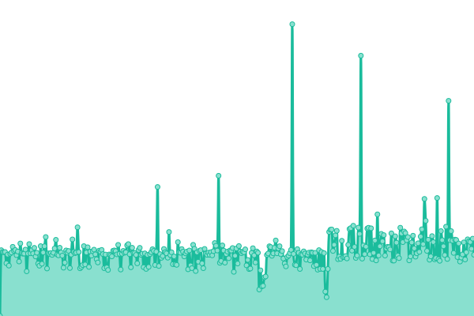
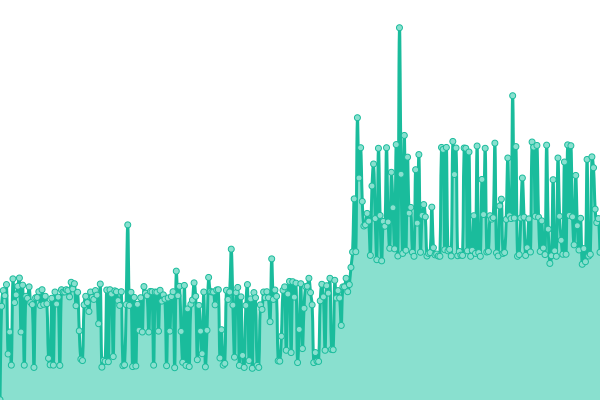
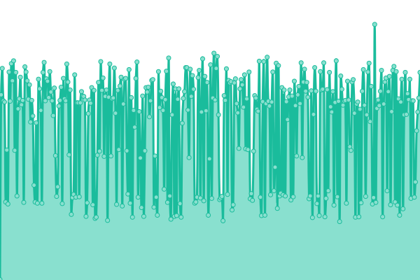
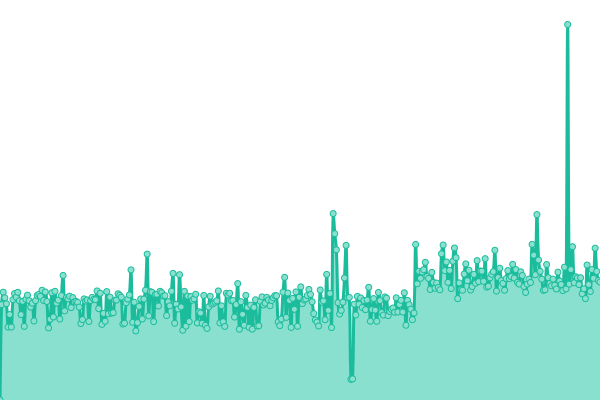

# [📈 Live Status](https://SRESchool.github.io/AllDevopsschool-monitor-upptime): <!--live status--> **🟧 Partial outage**

This repository contains the open-source uptime monitor and status page for [SRESchool](https://SRESchool.github.io/AllDevopsschool-monitor-upptime), powered by [Upptime](https://github.com/upptime/upptime).

With [Upptime](https://upptime.js.org), you can get your own unlimited and free uptime monitor and status page, powered entirely by a GitHub repository. We use [Issues](https://github.com/SRESchool/AllDevopsschool-monitor-upptime/issues) as incident reports, [Actions](https://github.com/SRESchool/AllDevopsschool-monitor-upptime/actions) as uptime monitors, and [Pages](https://SRESchool.github.io/AllDevopsschool-monitor-upptime) for the status page.

<!--start: status pages-->
<!-- This summary is generated by Upptime (https://github.com/upptime/upptime) -->
<!-- Do not edit this manually, your changes will be overwritten -->
<!-- prettier-ignore -->
| URL | Status | History | Response Time | Uptime |
| --- | ------ | ------- | ------------- | ------ |
|  [AIOps School](https://aiopsschool.com) | 🟩 Up | [ai-ops-school.yml](https://github.com/SRESchool/AllDevopsschool-monitor-upptime/commits/HEAD/history/ai-ops-school.yml) | 

 290ms
     
 | 

<a href="https://SRESchool.github.io/AllDevopsschool-monitor-upptime/history/ai-ops-school">46.79%</a>
    

|  [AI Universe](https://aiuniverse.xyz) | 🟩 Up | [ai-universe.yml](https://github.com/SRESchool/AllDevopsschool-monitor-upptime/commits/HEAD/history/ai-universe.yml) | 

 1710ms
     
 | 

<a href="https://SRESchool.github.io/AllDevopsschool-monitor-upptime/history/ai-universe">46.79%</a>
    

|  [Best DevOps](https://bestdevops.com) | 🟩 Up | [best-dev-ops.yml](https://github.com/SRESchool/AllDevopsschool-monitor-upptime/commits/HEAD/history/best-dev-ops.yml) | 

 2922ms
     
 | 

<a href="https://SRESchool.github.io/AllDevopsschool-monitor-upptime/history/best-dev-ops">76.20%</a>
    

|  [Cloud Ops Now](https://cloudopsnow.in) | 🟥 Down | [cloud-ops-now.yml](https://github.com/SRESchool/AllDevopsschool-monitor-upptime/commits/HEAD/history/cloud-ops-now.yml) | 

 0ms
     
 | 

<a href="https://SRESchool.github.io/AllDevopsschool-monitor-upptime/history/cloud-ops-now">0.00%</a>
    

|  [XOps School](https://xopsschool.com) | 🟥 Down | [x-ops-school.yml](https://github.com/SRESchool/AllDevopsschool-monitor-upptime/commits/HEAD/history/x-ops-school.yml) | 

 0ms
     
 | 

<a href="https://SRESchool.github.io/AllDevopsschool-monitor-upptime/history/x-ops-school">0.00%</a>
    

|  [Debug School](https://debug.school) | 🟥 Down | [debug-school.yml](https://github.com/SRESchool/AllDevopsschool-monitor-upptime/commits/HEAD/history/debug-school.yml) | 

 0ms
     
 | 

<a href="https://SRESchool.github.io/AllDevopsschool-monitor-upptime/history/debug-school">0.00%</a>
    

|  [DevOps Consulting](https://devopsconsulting.in) | 🟩 Up | [dev-ops-consulting.yml](https://github.com/SRESchool/AllDevopsschool-monitor-upptime/commits/HEAD/history/dev-ops-consulting.yml) | 

 696ms
     
 | 

<a href="https://SRESchool.github.io/AllDevopsschool-monitor-upptime/history/dev-ops-consulting">46.80%</a>
    

|  [DevOps Freelancer](https://devopsfreelancer.com) | 🟩 Up | [dev-ops-freelancer.yml](https://github.com/SRESchool/AllDevopsschool-monitor-upptime/commits/HEAD/history/dev-ops-freelancer.yml) | 

 581ms
     
 | 

<a href="https://SRESchool.github.io/AllDevopsschool-monitor-upptime/history/dev-ops-freelancer">49.78%</a>
    

|  [DevOps School](https://devopsschool.com) | 🟩 Up | [dev-ops-school.yml](https://github.com/SRESchool/AllDevopsschool-monitor-upptime/commits/HEAD/history/dev-ops-school.yml) | 

 2144ms
     
 | 

<a href="https://SRESchool.github.io/AllDevopsschool-monitor-upptime/history/dev-ops-school">46.81%</a>
    

|  [DevOps School NL](https://devopsschool.nl) | 🟩 Up | [dev-ops-school-nl.yml](https://github.com/SRESchool/AllDevopsschool-monitor-upptime/commits/HEAD/history/dev-ops-school-nl.yml) | 

 1684ms
     
 | 

<a href="https://SRESchool.github.io/AllDevopsschool-monitor-upptime/history/dev-ops-school-nl">46.82%</a>
    

|  [DevOps School JP](https://devopsschool.jp) | 🟩 Up | [dev-ops-school-jp.yml](https://github.com/SRESchool/AllDevopsschool-monitor-upptime/commits/HEAD/history/dev-ops-school-jp.yml) | 

 1004ms
     
 | 

<a href="https://SRESchool.github.io/AllDevopsschool-monitor-upptime/history/dev-ops-school-jp">46.82%</a>
    

|  [DevOps School Org](https://devopsschool.org) | 🟥 Down | [dev-ops-school-org.yml](https://github.com/SRESchool/AllDevopsschool-monitor-upptime/commits/HEAD/history/dev-ops-school-org.yml) | 

 0ms
     
 | 

<a href="https://SRESchool.github.io/AllDevopsschool-monitor-upptime/history/dev-ops-school-org">0.00%</a>
    

|  [DevOps School XYZ](https://devopsschool.xyz) | 🟩 Up | [dev-ops-school-xyz.yml](https://github.com/SRESchool/AllDevopsschool-monitor-upptime/commits/HEAD/history/dev-ops-school-xyz.yml) | 

 1419ms
     
 | 

<a href="https://SRESchool.github.io/AllDevopsschool-monitor-upptime/history/dev-ops-school-xyz">64.04%</a>
    

|  [DevOps Support](https://devopssupport.in) | 🟩 Up | [dev-ops-support.yml](https://github.com/SRESchool/AllDevopsschool-monitor-upptime/commits/HEAD/history/dev-ops-support.yml) | 

 394ms
     
 | 

<a href="https://SRESchool.github.io/AllDevopsschool-monitor-upptime/history/dev-ops-support">46.84%</a>
    

|  [DevSecOps Now](https://devsecopsnow.com) | 🟩 Up | [dev-sec-ops-now.yml](https://github.com/SRESchool/AllDevopsschool-monitor-upptime/commits/HEAD/history/dev-sec-ops-now.yml) | 

 4008ms
     
 | 

<a href="https://SRESchool.github.io/AllDevopsschool-monitor-upptime/history/dev-sec-ops-now">50.63%</a>
    

|  [DevSecOps School](https://devsecopsschool.com) | 🟩 Up | [dev-sec-ops-school.yml](https://github.com/SRESchool/AllDevopsschool-monitor-upptime/commits/HEAD/history/dev-sec-ops-school.yml) | 

 390ms
     
 | 

<a href="https://SRESchool.github.io/AllDevopsschool-monitor-upptime/history/dev-sec-ops-school">46.84%</a>
    

|  [FinOps School](https://finopsschool.com) | 🟩 Up | [fin-ops-school.yml](https://github.com/SRESchool/AllDevopsschool-monitor-upptime/commits/HEAD/history/fin-ops-school.yml) | 

 389ms
     
 | 

<a href="https://SRESchool.github.io/AllDevopsschool-monitor-upptime/history/fin-ops-school">46.85%</a>
    

|  [Free Ebooks](https://freeebooks.xyz) | 🟥 Down | [free-ebooks.yml](https://github.com/SRESchool/AllDevopsschool-monitor-upptime/commits/HEAD/history/free-ebooks.yml) | 

 0ms
     
 | 

<a href="https://SRESchool.github.io/AllDevopsschool-monitor-upptime/history/free-ebooks">0.00%</a>
    

|  [NoOps School](https://noopsschool.com) | 🟩 Up | [no-ops-school.yml](https://github.com/SRESchool/AllDevopsschool-monitor-upptime/commits/HEAD/history/no-ops-school.yml) | 

 391ms
     
 | 

<a href="https://SRESchool.github.io/AllDevopsschool-monitor-upptime/history/no-ops-school">46.85%</a>
    

|  [Quantum Ops School](https://quantumopsschool.com) | 🟩 Up | [quantum-ops-school.yml](https://github.com/SRESchool/AllDevopsschool-monitor-upptime/commits/HEAD/history/quantum-ops-school.yml) | 

 397ms
     
 | 

<a href="https://SRESchool.github.io/AllDevopsschool-monitor-upptime/history/quantum-ops-school">46.86%</a>
    

|  [Quantum Uting](https://quantumuting.com) | 🟩 Up | [quantum-uting.yml](https://github.com/SRESchool/AllDevopsschool-monitor-upptime/commits/HEAD/history/quantum-uting.yml) | 

 2095ms
     
 | 

<a href="https://SRESchool.github.io/AllDevopsschool-monitor-upptime/history/quantum-uting">46.86%</a>
    

|  [Robots Ops](https://robotsops.com) | 🟩 Up | [robots-ops.yml](https://github.com/SRESchool/AllDevopsschool-monitor-upptime/commits/HEAD/history/robots-ops.yml) | 

 1858ms
     
 | 

<a href="https://SRESchool.github.io/AllDevopsschool-monitor-upptime/history/robots-ops">46.87%</a>
    

|  [SRE School IN](https://sreschool.in) | 🟥 Down | [sre-school-in.yml](https://github.com/SRESchool/AllDevopsschool-monitor-upptime/commits/HEAD/history/sre-school-in.yml) | 

 0ms
     
 | 

<a href="https://SRESchool.github.io/AllDevopsschool-monitor-upptime/history/sre-school-in">0.00%</a>
    

|  [The AIOps](https://theaiops.com) | 🟩 Up | [the-ai-ops.yml](https://github.com/SRESchool/AllDevopsschool-monitor-upptime/commits/HEAD/history/the-ai-ops.yml) | 

 2386ms
     
 | 

<a href="https://SRESchool.github.io/AllDevopsschool-monitor-upptime/history/the-ai-ops">46.87%</a>
    

|  [The Data Ops](https://thedataops.org) | 🟩 Up | [the-data-ops.yml](https://github.com/SRESchool/AllDevopsschool-monitor-upptime/commits/HEAD/history/the-data-ops.yml) | 

 2253ms
     
 | 

<a href="https://SRESchool.github.io/AllDevopsschool-monitor-upptime/history/the-data-ops">46.88%</a>
    

|  [SRE School](https://sreschool.com) | 🟩 Up | [sre-school.yml](https://github.com/SRESchool/AllDevopsschool-monitor-upptime/commits/HEAD/history/sre-school.yml) | 

 288ms
     
 | 

<a href="https://SRESchool.github.io/AllDevopsschool-monitor-upptime/history/sre-school">46.88%</a>
    

|  [SCM Galaxy](https://scmgalaxy.com) | 🟥 Down | [scm-galaxy.yml](https://github.com/SRESchool/AllDevopsschool-monitor-upptime/commits/HEAD/history/scm-galaxy.yml) | 

 0ms
     
 | 

<a href="https://SRESchool.github.io/AllDevopsschool-monitor-upptime/history/scm-galaxy">0.00%</a>
    

<!--end: status pages-->

[**Visit our status website →**](https://SRESchool.github.io/AllDevopsschool-monitor-upptime)

## 📄 License

- Powered by: [Upptime](https://github.com/upptime/upptime)
- Code: [MIT](./LICENSE) © [Anand Chowdhary](https://anandchowdhary.com), supported by [Pabio](https://pabio.com)
- Data in the `./history` directory: [Open Database License](https://opendatacommons.org/licenses/odbl/1-0/)
